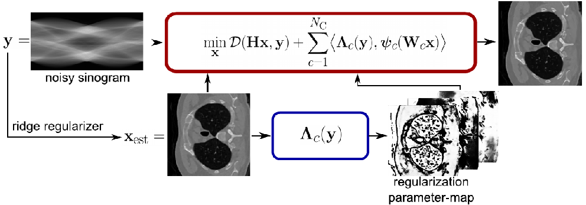

# Stability of Data-Dependent Ridge-Regularization for Inverse Problems

This code belongs to the paper [1] available at https://arxiv.org/abs/2406.12289. Please cite the paper, if you use this code.

The repository contains an extension of the ridge-regularizers [2,3] with a data-adaptive and spatially varying regularization mask. 


Herewith you can reproduce the experimental results of [1]. 

For questions and bug reports, please contact Fabian Altekrüger (fabian.altekrueger@hu-berlin.de).

## CONTENTS

1. ENVIRONMENT SETTINGS
2. USAGE AND EXAMPLES
3. REFERENCES

## 1. ENVIRONMENT SETTINGS

The code requires several Python packages. You can create a conda environment using `environment.yaml` by the command
```python
conda env create --file=environment.yaml
```
Additionally, you have to install the latest version of ODL via pip:
```python
pip install https://github.com/odlgroup/odl/archive/master.zip --upgrade
```

## 2. USAGE AND EXAMPLES

The trained models can be found in the folder `trained_models` such that you do not need to retrain any of the networks. 
If you want to retrain the regularization mask, you need to download and preprocess the training data. We use the training data from [2], which are centercropped grayscale BSD [6] images. You can download and move it to the correct folder by the command
```python
git clone git@github.com:axgoujon/weakly_convex_ridge_regularizer.git && mv weakly_convex_ridge_regularizer/training/data/images/BSD utils/images utils/images
```
Then you need to preproces the data with the file `preprocess_BSD.py` (in folder `utils`) and you can start the training of the mask by the command
```python
python train_mask.py --rr='crr'
```
If you want to train the mask for the WCRR instead, then simply set the flag to `wcrr`.


### DENOISING

The script `run_denoise.py` is the implementation of the denoising example in [1, Section 5.1]. We use the BSD68 images for testing.
To denoise an image, you can run the script `run_denoise.py`
```python
python run_denoise.py --rr='crr'
```
If you want to use the WCRR instead, set the flag `--rr='wcrr'`. If you do not want to use the regularization mask, set the flag `-m`. You can change the noise level with the flag `-n`. If you want to visualize the mask and its responses, set the flag `--vis`. You can evaluate the approach on the BSD68 dataset by setting the flag `--test`.


### MRI IMAGING

The script `run_MRI.py` is the implementation of the MRI example in [1, Section 5.2]. The used data is from the fastMRI dataset [4], which is available at https://fastmri.med.nyu.edu/. You first need to download and extract the folder `knee_multicoil_val`, such that it is in the folder `utils/images/fastMRI`. Moreover, you need to install the BART Toolbox [7], which can be done by
```python
cd utils && wget https://github.com/mrirecon/bart/archive/refs/tags/v0.8.00.zip && unzip v0.8.00.zip && rm v0.8.00.zip && cd bart-0.8.00 && make && cd .. && cd ..
```
Then you can prepare the singlecoil (flag `-s`) and multicoil (flag `-m`) dataset by running the script `generate_mri_data.py` (in folder `utils`).
For the experiments we assume that we are given 10 validation images. To adjust the mask on the specific image data, you can run the script `finetune_mask.py`
```python
python finetune_mask.py -fmri --rr='crr'
```
Again, you need to set the flag `--rr='wcrr'` for the WCRR. To reconstruct a MRI scan from a given noisy measurement, you can run the script `run_MRI.py`
```python
python run_MRI.py --rr='crr' -c='single'
```
If you first want to determine the regularization scale and the noise level, set the flag `-val` to start the validation procedure. If you want to set the mask off, then set the flag `-m`. To change to the multicoil setting, set the flag `-c='multi'`. You can also consider fat supression with the flag `-f`. 


### CT IMAGING

The script `run_CT.py` is the implementation of the CT example in [1, Section 5.3]. The used data is from the LoDoPaB dataset [5], which is available at https://zenodo.org/record/3384092##.Ylglz3VBwgM. Here we assume that we are given 6 validation images. To adjust the mask on the specific image data, you can run the script `finetune_mask.py`
```python
python finetune_mask.py -fct --rr='crr'
```
Again, you need to set the flag `rr='wcrr'` for the WCRR. To reconstruct a CT scan from a given noisy low-dose sinogram, you can run the script `run_CT.py`
```python
python run_CT.py --rr='crr'
```
If you first want to determine the regularization scale and the noise level, set the flag `-val` to start the validation procedure. If you want to set the mask off, then set the flag `-m`. To change to the limited-angle setting, set the flag `-s='limited'`. 


### SUPERRESOLUTION

The script `run_SiC.py` is the implementation of the superresolution example in [1, Section 5.4]. The used images of material microstructures have been acquired in the frame of the EU Horizon 2020 Marie Sklodowska-Curie Actions Innovative Training Network MUMMERING (MUltiscale, Multimodal and Multidimensional imaging for EngineeRING, Grant Number 765604) at the beamline TOMCAT of the SLS by A. Saadaldin, D. Bernard, and F. Marone Welford.
Here we do not adjust the regularization mask to the image set.
To reconstruct a high-resolution image from a given noisy low-resolution image, you can run the script `run_SiC.py`
```python
python run_SiC.py --rr='crr'
```
If you first want to determine the regularization scale and the noise level, set the flag `-val` to start the validation procedure. If you want to set the mask off, then set the flag `-m`.


## 3. REFERENCES

[1] S. Neumayer and F. Altekrüger.  
Stability of Data-Dependent Ridge-Regularization for Inverse Problems.  
arXiv preprint arXiv:2406.12289.

[2] A. Goujon, S. Neumayer, P. Bohra, S. Ducotterd, and M. Unser.  
A neural-network-based convex
regularizer for inverse problems.  
IEEE Transactions on Computational Imaging, 9:781–795, 2023.

[3] A. Goujon, S. Neumayer, and M. Unser.  
Learning weakly convex regularizers for convergent
image-reconstruction algorithms.  
SIAM Journal on Imaging Sciences, 17(1):91–115, 2024.

[4] F. Knoll, J. Zbontar, A. Sriram, M. J. Muckley, M. Bruno, A. Defazio, M. Parente, K. J. Geras,
J. Katsnelson, H. Chandarana, Z. Zhang, M. Drozdzalv, A. Romero, M. Rabbat, P. Vincent,
J. Pinkerton, D. Wang, N. Yakubova, E. Owens, C. L. Zitnick, M. P. Recht, D. K. Sodickson, and
Y. W. Lui.  
fastMRI: A publicly available raw k-space and DICOM dataset of knee images for accelerated MR image reconstruction using machine learning.  
Radiology: Artificial Intelligence, 2(1):e190007, 2020.

[5] J. Leuschner, M. Schmidt, D. O. Baguer and P. Maass.  
LoDoPaB-CT, a benchmark dataset for low-dose computed tomography reconstruction.  
Scientific Data, 9(109), 2021.

[6] D. Martin, C. Fowlkes, D. Tal, and J. Malik.  
A database of human segmented natural images and its application to evaluating segmentation algorithms and measuring ecological statistics.  
Proceedings Eighth IEEE International Conference on Computer Vision, volume 2, 2001.

[7] M. Uecker, P. Lai, M. J. Murphy, P. Virtue, M. Elad, J. M. Pauly, S. S. Vasanawala, and M. Lustig.  
ESPIRiT-An eigenvalue approach to autocalibrating parallel MRI: Where SENSE meets GRAPPA.  
Magnetic Resonance in Medicine, 71(3):990–1001, 2014.

## CITATION

```python
@article{NA2024,
    author    = {Neumayer, Sebastian and Altekrüger, Fabian},
    title     = {Stability of Data-Dependent Ridge-Regularization for Inverse Problems},
    journal   = {arXiv preprint arXiv:2406.12289},
    year      = {2024}
}
```
